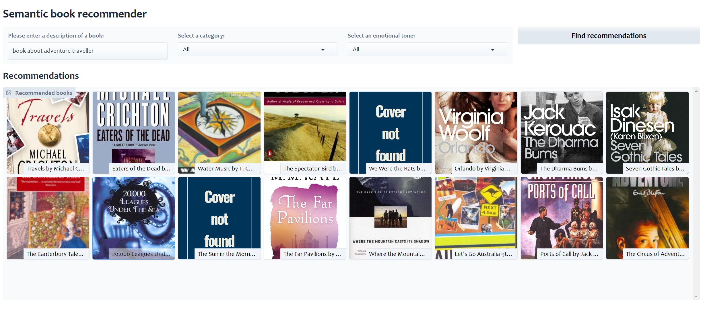
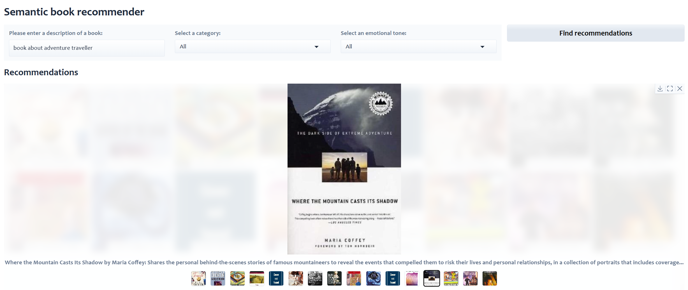

# Semantic Book Recommender

A sophisticated book recommendation system powered by Large Language Models (LLMs) that provides personalized book suggestions based on natural language descriptions, categories, and emotional tones.

## 🙏 Acknowledgments

- Project heavily inspired by freeCodeCamp.org's tutorial
- Book dataset sourced from Kaggle
- Leverages models from Hugging Face and OpenAI

## 🎯 Features

- **Natural Language Search**: Find books by describing what you're looking for in plain English
- **Category Filtering**: Filter recommendations by fiction, non-fiction, children's books, and more
- **Emotional Tone Matching**: Sort recommendations by emotional tones (happy, surprising, angry, suspenseful, sad)
- **Interactive Interface**: User-friendly web interface built with Gradio
- **Smart Recommendations**: Uses semantic (vector) search with RAG (Retrieval Augmented Generation) to find similar books

## 🎨 Example Interface






## 🛠️ Technical Approach

### 1. Data Preparation
- Downloaded and cleaned book dataset from Kaggle
- Enhanced dataset with the following steps:
  1. Category Classification
     - Used zero-shot classification with `facebook/bart-large-mnli` model
     - Classified books into main categories (Fiction, Non-fiction, Children's Fiction, etc.)
     - Filled missing categories automatically
  
  2. Emotional Tone Analysis
     - Implemented sentiment analysis using `j-hartmann/emotion-english-distilroberta-base`
     - Generated emotional scores (0-1) for:
       - Anger
       - Fear (Suspense)
       - Joy (Happiness)
       - Sadness
       - Surprise

### 2. Vector Search Implementation
- Created embeddings for book descriptions using OpenAI's embedding model
- Built a vector database using Chroma for efficient similarity search
- Implemented RAG for semantic similarity matching

### 3. Web Application
- Built with Gradio framework
- Features an intuitive interface for:
  - Natural language query input
  - Category selection
  - Emotional tone filtering
- Displays results in a gallery view with book covers and descriptions

## 🚀 Getting Started

### Prerequisites
- Python 3.8+
- OpenAI API key
- Required Python packages (install via `pip install -r requirements.txt`):
  - langchain
  - openai
  - chromadb
  - gradio
  - pandas
  - numpy
  - transformers
  - python-dotenv

### Installation

1. Clone the repository:
```bash
git clone [your-repository-url]
cd semantic-book-recommender
```

2. Create and activate a virtual environment (optional but recommended):
```bash
python -m venv venv
source venv/bin/activate  # On Windows: venv\Scripts\activate
```

3. Install dependencies:
```bash
pip install -r requirements.txt
```

4. Create a `.env` file in the root directory and add your OpenAI API key:
```
OPENAI_API_KEY=your_api_key_here
```

### Running the Application

1. Start the web interface:
```bash
python gradio-dashboard.py
```

2. Open your browser and navigate to the provided local URL (typically `http://localhost:7860`)


